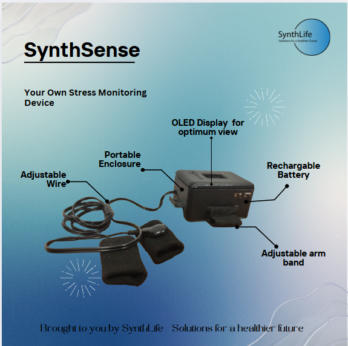
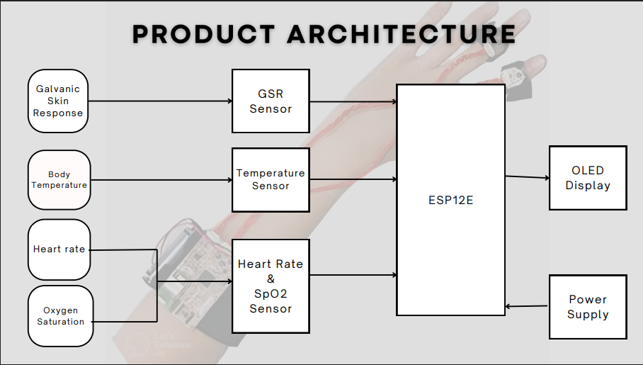

# Portable and Wearable Stress Monitoring Device

A wearable health monitoring system that tracks multiple physiological parameters to help users monitor and manage stress levels.

## Overview

This project was developed as part of the EN1190-Engineering Design Project. The device combines multiple sensors to accurately measure physiological indicators of stress and provide real-time feedback to users.

## Features

- **Portable and Wearable Design**: Compact form factor for everyday use
- **Multi-Sensor Approach**: Uses multiple physiological parameters for more accurate stress detection
- **Real-Time Monitoring**: Provides immediate feedback on current stress levels
- **User-Friendly Interface**: Simple display with easy-to-understand stress level indicators

## Hardware Components

### Main Components
- ESP12E microcontroller with built-in WiFi
- Galvanic Skin Response (GSR) sensor
- Temperature sensor (MLX90614)
- Heart rate and SpO2 sensor (MAX30100)
- OLED Display (DM0037)
- 3.7V 1000mAh Rechargeable LiPo Battery

### Hardware Specifications

#### ESP12E
- Operating voltage: 2.2V to 3.6V
- Operating temperature: -40°C to +125°C
- Working current: 240mA (MAX)
- Built-in WiFi capability

#### Heart Rate & SpO2 Sensor (MAX30100)
- Operating voltage: 1.8V to 3.3V
- Fast data output capability
- Built-in temperature sensor for environmental compensation

#### Temperature Sensor (MLX90614)
- Operating voltage: 3-5V
- Range: -40°C to +125°C (ambient) | -70°C to 380°C (object)
- Accuracy: ±0.5°C

#### Galvanic Skin Response Sensor
- Operating voltage: 3.3-5V
- Measures electrical conductance of skin

#### OLED Display (DM0037)
- Operating voltage: 3.3V–5V DC
- Low power consumption: 0.04W during normal operation
- Working temperature: -30°C to 80°C

## Enclosure Design

The device features a custom 3D-printed enclosure designed for comfort and usability.

## How It Works

The device uses an algorithm that analyzes data from multiple sensors to determine the user's stress level:

1. **Data Collection**: Continuously monitors GSR, body temperature, and heart rate
2. **Data Processing**: Applies algorithms to analyze sensor readings
3. **Stress Evaluation**: Categorizes stress levels as Relaxed, Calm, Anxious, or Stressed
4. **User Feedback**: Displays the current stress level on the OLED screen

### Algorithm Parameters

| Parameter | Low | Medium | High | Very High |
|-----------|-----|--------|------|-----------|
| GSR | < 2 | 2 - 4 | 4 - 6 | > 6 |
| Temperature (°C) | < 35 | 35 - 37 | 37 - 38.5 | > 38.5 |
| Heart Rate (BPM) | 60 - 70 | 70 - 90 | 90 - 100 | > 180 |

## Usage Notes

For accurate readings, the device should be used under the following conditions:
- Normal resting state (not during physical activities)
- GSR sensor needs calibration for individual users
- Consistent positioning on the body

## Development Process

### PCB Design
The PCB was designed using Altium Designer and features two separate units:
- Power Supply Unit
- Main Circuit

### Known Issues and Solutions
During testing, we identified and resolved several issues:
- Insufficient input voltage to the regulator
- High resistance in power lines causing current limitations
- Grounding issues with switches
- Current draw issues with the ESP12E chip

## Team Members

- **P.L.P. Perera**: Microcontroller Programming and Testing, Documentation, Assembling Components
- **S.R.N. Fernando**: Market Analysis, Enclosure Design, Assembling Components, Soldering
- **G.M.L. Dulsara**: Microcontroller Programming and Testing, Documentation, Assembling Components, Market Analysis
- **M.H.K. Yashodhara**: Microcontroller Programming and Debugging, Documentation, Budget Coordination, Assembling Components

## License

[Insert appropriate license information here]

## Contact

For questions or feedback, please contact [insert contact information].
